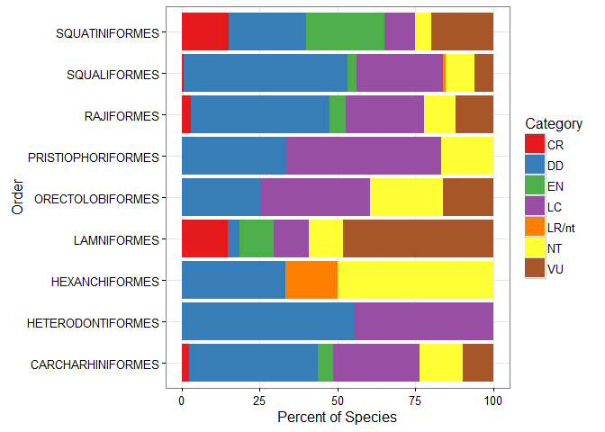

```{r setup, include=FALSE}
knitr::opts_chunk$set(echo = FALSE)
library(devtools)
library(fish.ecol)
library(shiny)
library(networkD3)
library(data.tree)
library(dplyr)
library(tidyr)
library(googleVis)
library(readr)
```

```{r}

Extantify=function(subsetcolumns=NA,factors=NA, dir="a"){
  
  if(length(subsetcolumns)!=length(factors)){stop("Error: subsetcolumns input is not the same length as the factors input. These should match in ")}
  
  if (dir=="a"){
    #Load in original data set- note this will take a couple seconds
    LongData=read.csv("./data/Long Format Collected Fish Information IUCN")
    
    #Load in land locked data set (ISO3 codes)
    Landlocked=read.csv("./data/Landlocked.csv")
  }
  
  if (dir=="b"){
    #Load in original data set- note this will take a couple seconds
    LongData=read.csv("../fish.ecol/data/Long Format Collected Fish Information IUCN")
    
    #Load in land locked data set (ISO3 codes)
    Landlocked=read.csv("../fish.ecol/data/Landlocked.csv")
  }
  
  #Exclude landlocked countries
  OceanNationsOnly=LongData[!LongData$CountryISO3%in%Landlocked$Landlocked_Countries,]
  
  #Find the extant classifications: 1- Introduced 2- Native 6- Reintroduced
  extantIDX=grepl("1|2|6",as.character(OceanNationsOnly$Species_Presence))
  
  extant=OceanNationsOnly[extantIDX,-c(1,5,6)]
  
  if(is.na(subsetcolumns[1])){return(extant)}else{
    for(i in 1:length(subsetcolumns)){
      IDXl=grepl(paste(factors[[i]],collapse="|"),extant[[subsetcolumns[[i]]]])
      extant=extant[IDXl,]
    }
    return(extant)
  }
}


iucn_index=function(data, scores=c(1,2,3,4,5,6,7), type="a"){
  
  # agregar un if que defina que tipo de dato es
  
  data=as.factor(data)
  
  S=summary(data)
  SS=data.frame(category=names(S),count=S)
  
  all=data.frame(c("DD", "LC", "LR/nt", "NT", "VU", "EN", "CR"))
  colnames(all)=c("category")
  
  S=left_join(all, SS, by="category")
  
  S$count[is.na(S$count)]=0
  
  ifelse (type=="a",
          {
            index=(scores[1]*S$count[S$category=="DD"]+
                     scores[2]*S$count[S$category=="LC"]+
                     scores[3]*S$count[S$category=="LR/nt"]+
                     scores[4]*S$count[S$category=="NT"]+
                     scores[5]*S$count[S$category=="VU"]+
                     scores[6]*S$count[S$category=="EN"]+
                     scores[7]*S$count[S$category=="CR"]
            )/sum(S$count)
          },
          {
            index=(scores[1]*S$count[S$category=="DD"]+
                     scores[2]*S$count[S$category=="LC"]+
                     scores[3]*S$count[S$category=="LR/nt"]+
                     scores[4]*S$count[S$category=="NT"]+
                     scores[5]*S$count[S$category=="VU"]+
                     scores[6]*S$count[S$category=="EN"]+
                     scores[7]*S$count[S$category=="CR"]
            )/(sum(S$count)*scores[7])
          }
  )
  
  
  return(index)
  
}


```


## Introduction

- What is the IUCN Red List?

>- The IUCN provides a useful tool for setting conservation priorities

>- Our project: aggregate and visually display information from the IUCN Red List

## Research Questions

- How do threat levels vary across the globe?

>- How do different taxonomic groups compare as conservation priorities?

## Methodology (part 1) {.build}

- Data Wrangling and the IUCN database

- `fish.ecol::Extantify()`

```{r, echo = FALSE}
head(Extantify()[,1:4])
```

## Methodology (part 2)

- An index to asses global status
- `fish.ecol::iucn_index()`

>- Weighted average $$score=\frac{\sum_{i=1}^n W_i X_i}{\sum_{i=1}^n X_i}$$

>- Relative weighted average $$score=\frac{\sum_{i=1}^n W_i X_i}{W_n \sum_{i=1}^n X_i}$$

>- Where $W$ is a vector containing the weights, and $X$ contains the counts for each category $i$. With al IUCN categories, $n=7$.

## TaxApp

```{r, TaxApp, output="asis", message=FALSE}


ui<-shinyUI(fluidPage(
  titlePanel("CHONDRICHTHYES"),
  
  sidebarLayout(
    sidebarPanel(
      helpText("Choose a IUCN category to display"),
      
      selectInput(inputId = "var", 
                  label = "CR = Critically endangered or EN = Endangered",
                  choices = list("EN","CR"),
                  selected = "CR")
      
    ),
    
    mainPanel(
      radialNetworkOutput("force")
    )
  )
))

fish <- read.csv("./Shiny-fish-ecol/data/taxdata.csv")

server<-shinyServer(function(input, output) {
  output$force <- renderRadialNetwork({
    taxdata <- fish[fish$Category==input$var,]
    
    taxdata$pathString=paste(taxdata$Class,
                             taxdata$Order,
                             taxdata$Family,
                             taxdata$Genus,
                             taxdata$Scientific.Name,
                             sep="/")
    
    taxtree=as.Node(taxdata, mode="table", pathDelimiter="/", pathName="pathString")
    
    taxlist=ToListExplicit(taxtree, unname = TRUE) 
    
    
    radialNetwork(taxlist, fontSize=10, nodeColour="red", textColour="blue", opacity=1, linkColour="black")
  })
  
})

shinyApp(ui = ui, server = server)

```


## MapApp

```{r, MapApp, output="asis"}

iucn_map=function(dataset){

  library(shiny)
  library(dplyr)
  library(tidyr)
  library(googleVis)
  library(readr)

# Define UI for application that draws a histogram
ui <- shinyUI(fluidPage(
   
   # Application title
   titlePanel("IUCN Index MapApp"),
   
   # Sidebar
   sidebarLayout(
      sidebarPanel(
        # Dropdown menu to pick a class
         selectInput(inputId="Class",
                     label="Chose a Class",
                     choices=c("CHONDRICHTHYES",
                               "ACTINOPTERYGII",
                               "MYXINI",
                               "SARCOPTERYGII"),
                     selected="CHONDRICHTHYES"),
         # Dropdown menu to select an index
         selectInput(inputId="index",
                     label="Choose an index",
                     choices=c("iucn index",
                               "total species (by category)"),
                     selected="iucn index"),
         # Dropdown menu to select a category
         selectInput(inputId="category",
                     label="Choose a category (only for ´total species´)",
                     choices=c("DD",
                               "LC",
                               "LR/nt",
                               "NT",
                               "VU",
                               "EN",
                               "CR"),
                     selected="CR")
      ),
      
      # Show a plot of the generated distribution
      mainPanel(
        htmlOutput("gvis")
      )
   )
))

# Define server logic required to draw a histogram
server <- shinyServer(function(input, output) {
   
   output$gvis=renderGvis({
      ##### FISH ECOL STARTS HERE
     
     cat=c("DD","LC","LR/nt","NT","VU","EN","CR")
     ind=seq(1,7)
     cat2val=data.frame(Category=cat, index=ind)
     
     conversion <- read_csv(file="./data/CountryConversion.csv")
     
     
     dataset2 = dataset %>% #generating the fishDataCountries output
       left_join(cat2val, by=c("Category")) %>% #joining with cat2val by Category
       rename(ISO3=CountryISO3) %>%             #rename common column with ISO3
       left_join(conversion, by=c("ISO3")) #joining with conversion by ISO3
      
     if (input$index=="total species (by category)"){
       dataset2=dataset2 %>%
         filter(Category==input$category)
     }
     
      dataset2 = dataset2 %>%
        filter(Class==input$Class) %>% #Filter by inputs from shiny app
        group_by(World_Bank_Country,ISO2) %>% #grouping by ISO3 column
        summarize(score=iucn_index(Category, type="b"), N=n()) #Calculates a score based on our new iucn_index function
      
      
      # Plot countries, I am using the mean as an example of the index that we want to show in this map (we have to create the index) 
      
      colnames(dataset2)=c("Country", "ISO2", "score", "N") #Fix colnames
      
      #Define type of output
      if(input$index=="total species (by category)"){
       show="N"
      }
      if (input$index=="iucn index"){
        show="score"
      }
      
      #### Create a geo chart 
        gvisGeoChart(dataset2, "ISO2", show, hovervar="Country",
                     options=list(gvis.editor="S&P",
                                  colorAxis="{colors:['#91BFDB', '#FC8D59']}"))

   })
})

# Run the application 
shinyApp(ui = ui, server = server)
}


#library(devtools)
#install_github(repo="fish-ecol/fish.ecol") #So that the server recognizes our functions
#library(fish.ecol)
#load_all("../fish.ecol")
dataset=Extantify(dir="a")
iucn_map(dataset)
```

## Results and Visualizations



## Final Remarks

- Fishing down and through the marine food webs (Pauly et al. 1998)

>- sharks and rays are considered  the most endangered vertebrates (Dulvy et al. 2014)

>- This map can lead scientists, managers and conservation efforts to prioritize countries “areas” on where to focus their actions.


