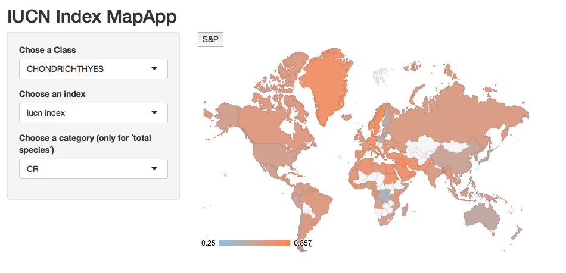

```{r setup, include=FALSE}
#This chunk sets up the initial options for the document. They can be overwriten in any othe chunk
knitr::opts_chunk$set(echo = FALSE)

suppressPackageStartupMessages({
  library(RColorBrewer)
  library(ggplot2)
  library(tidyr)
  library(dplyr)
})
```

##Introduction

Our project was focused on the exploration and visualization of data from the International Union for Conservation of Nature and Natural Resources (IUCN) Red List (IUCN 2015). Specifically, we examined marine fish species from the Red List with a particular interest in threatened species and their distributions worldwide. A problem that is commonly presented to conservationists is where to focus efforts to have the largest positive impact for biodiversity. The IUCN Red List has been described as a powerful tool for conservationists (Rodrigues et al. 2006). Our project aims to utilize the IUCN dataset in such a way that informs international conservation groups on critical areas for conservation.

The scientific question we explored was how threat levels as characterized by the IUCN Red List varied across countries. Although the IUCN Red List data does not provide a complete picture of fish species globally, it can serve as an initial look that may help inform organizations and governments on the priority of conservation efforts. Further analysis within a country is required to advise the best conservation strategies to be employed.

##Innovative Examples

**Assessing global marine biodiversity status within a coupled socio-ecological perspective**

The first example of a similar, but more in-depth analysis along this scientific question was done in a study by Selig et al. (2013). The authors examined marine species data from the IUCN Red List for 151 coastal countries, generating maps of exclusive economic zones (EEZs) along with scores based on overall biodiversity (Figure 1A), threatened species (Figure 1B), and habitats (Figure 1C). 

<div style="width:700px; height=800px">

</div>

These maps provide a snapshot of areas that are of particular concern. Areas with high overall biodiversity but low species threat may require careful maintenance of current status quo to avoid conservation issues in the future while areas with high species threat may be conservation priorities for governments and organizations. In particular, it appears that some areas in South America have zones of concern (e.g. Argentina and Ecuador) while most of Africa is of particular concern as well. Southeast Asia also appears to be an area for potential conservation actions. Although these problem zones are already recognized, this map provides a quick and simple visual understanding of areas of concern.

**Collapse of the world’s largest herbivores**

The next innovative example of uses for the IUCN Red List was in a paper by Ripple et al. (2015) on large herbivores and their threats. Similarly to the previous paper, the authors of this paper created a map examining the total biodiversity of large herbivore species (Figure 2A) along with a map of threatened large herbivore species (Figure 2B). 

<div style="width:600px; height=1100px">

</div>

This provides a useful look at areas of particular concern for conservation action as it breaks this down further than country-level analysis by using the spatial data contained in the IUCN Red List. This data is relatively high quality since large herbivores are well-studied, allowing for accurate analysis in this fashion.

The authors analyzed the IUCN Red List data further by obtaining the listed species threats contained in the IUCN Red List (Figure 3). This further narrows down conservation priorities by highlighting the most relevant threats for the species they studied.

<div style="width:600px; height=400px">

</div>


## Methods

Our objectives were to provide an overall assesment of the state of fish species in the world. We created an R package (`fish.ecol`), that is available in the release version of our [GitHub Repository](https://github.com/fish-ecol/fish.ecol/releases/tag/v1.0), or can be directly installed with `devtools::install_github(repo="fish-ecol/fish.ecol")`.

Prior to the creation and use of our two main functions, we needed to extract data from the IUCN Red List on species information by country. With the use of several python scripts (developed by an external software engineer), we extracted the data into a simple format from html pages with additional text information. Although we did not use all of this data, it provides a useful source of further analysis. 

The output of these scripts were joined with data sheets directly downloadable from the IUCN Red List to provide more information on species habitats and taxonomic levels. The resulting data table in long format was used as the basis for all further analyses, which required a function for simple manipulation of data.

Within the`fish.ecol` package, we created two main functions: `fish.ecol::Extantify()` and `fish.ecol::iucn_index()`. The function `fish.ecol::Extantify()` was created to address this need as a data extraction tool for simple usage. It wrapped a number of data needs into a single function such as removing presence data outside of our scope (regionally extinct species or uncertain distributions) and non-coastal countries in the output. Additionally, it provided a flexible framework for subsetting the data output to reduce the number of code lines needed in our analyses.

The function `fish.ecol::iucn_index()` was created to standarize the assesment of IUCN status for each country. The function essentialy calculates a weighted average for IUCN's categories. It can calculate it as an absolute index, or a relative index (0 to 1). The weights of each category can be supplied by the user, thus allowing it to virtualy ignore custom categories. When combined with `fish.ecol::Extantify()` and `dplyr::summarise()`, we can obtain a score for each country. The mathematical expression for both ways of calculating the index are provided below:

Weighted average $$score=\frac{\sum_{i=1}^n W_i X_i}{\sum_{i=1}^n X_i}$$

Relative weighted average $$score=\frac{\sum_{i=1}^n W_i X_i}{W_n \sum_{i=1}^n X_i}$$

Where $W$ is a vector containing the weights, and $X$ contains the counts for each category $i$. With al IUCN categories, $n=7$.


## Fish-Ecol Apps

We created two different Shiny Applications. The first one (Fig. 4) represents a taxonomic tree of Elasmobranch species. The user can select between Endangered or Criticaly Endangered. The app can be accesed here <https://faundez.shinyapps.io/Shiny-fish-ecol/>, or called with `shiny::runGitHub("fish-ecol/fish-ecol.github.io", subdir = "Shiny-fish-ecol/")`


We also created an interactive map where our iucn index is represented by country (Fig. 5). The user can choose which taxon to get information from, and modify the type of index to be shown. This app uses our `fish.ecol` package, and thus does not run on the Shiny App Server (yet). Nevertheless, it can be run locally with the following: `shiny::runGitHub("fish-ecol/fish-ecol.github.io", subdir="iucn_map")`.



## Results

In our analysis, we examined the two primary taxonomic classes of marine fish: Actinopterygii and Chondrichthyes as listed in the IUCN Red List (Figure 5). In particular we were interested in examining the differences between the IUCN listing status for the two groups. Interestingly, Chondrichthyes had not only a higher proportion of species in the three threat categories, Critically Endangered (CR), Endangered (EN), and Vulnerable (VU), but also more species in the Data Deficient (DD) category. This is of particular concern as it means the class of Chondrichthyes is less studied and may have a higher number of threatened species in it. For conservation, priority may be on funding research into the understudied species.

```{r IUCN Taxonomic Graphs,echo=FALSE,fig.width=9, fig.height=6, fig.cap="Figure 6. Species Category Percentages By Class"}
Taxonomic=read.csv("./Data/Taxonomic_and_Status.csv")
#Note that some of the scientific names are a little bit funky in these files. They seem to have not too much information on them and as such have weird characters that may confuse any code used for joining and such.

#convert low count categories to closest related cateogry (consolidating categories-- we can also just remove them). #note that grep below finds the index of LR/cd OR LR/lc.
Taxonomic$Category[grep("LR/cd|LR/lc",Taxonomic$Category)]="LC" 
Taxonomic$Category[grep("LR/nt",Taxonomic$Category)]="NT"
Taxonomic$Category[grep("EW",Taxonomic$Category)]="EX"
Taxonomic$Category=factor(Taxonomic$Category,levels=c("EX","CR","EN","VU","NT","LC","DD")) 

SummaryTable=data.frame(table(Taxonomic$Category,Taxonomic$Class))
names(SummaryTable)=c("GlobalStatus","Class","Count")

colours=brewer.pal(name="OrRd", n=nlevels(SummaryTable$GlobalStatus))
names(colours)=rev(levels(SummaryTable$GlobalStatus))

SummaryTable1=SummaryTable[SummaryTable$Class=="ACTINOPTERYGII"|SummaryTable$Class=="CHONDRICHTHYES",]

CategoryGraph=ggplot(data=SummaryTable1,aes(x=Class,y=Count,fill=GlobalStatus,order=GlobalStatus,width=.3))+
    geom_bar(stat="identity",show.legend=T,position="fill")+
    guides(fill=guide_legend(reverse=TRUE))+
    scale_fill_manual(values=colours,labels=c("Extinct","Critically Endangered","Endangered","Vulnerable","Near Threatened","Least Concern","Data Deficient"))+
    ylab("Percent of Species")+
    scale_y_continuous(labels = scales::percent)+
    ggtitle(NULL)+
    theme_bw()+
    scale_x_discrete(labels=c("ACTINOPTERYGII"="Actinopterygii (n=13442)","CHONDRICHTHYES"="Chondrichthyes (n=1138)"))+
    geom_bar(stat="identity",color="black",position="fill",show.legend=FALSE)+
    xlab(NULL)+
    theme(legend.background = element_rect(colour = "black"),plot.title = element_text(size = 17, vjust = 2),axis.text=element_text(size=12),axis.title=element_text(size=15,vjust = 1),legend.title=element_blank(),legend.text=element_text(size=13))

CategoryGraph
```

We also performed a deeper analysis within Elasmobranch species, which are under significant fishing pressure throughout the world. Within Elasmobranchs, The Order Squatiniformes was the most vulnerable of all, with a great proportion of the species identified as Critical (CR), Endangered (EN) or Vulnerable (VU). Off the shores of Baja California, Mexico, a member of this order *Squatina californica* has received heavy angling pressure, and their populations have significantly declined (Domínguez-Reza, pers. com.). Lamniform sharks were also significantly threatened, as a portion of the species have been marked as Critical (CR) and Vulnerable (VU).

```{r, echo=FALSE, fig.cap="Figure 7. Categories for each Order within Elasmobranch"}

elasmo <- read.csv("Data/Elasmo.csv") %>%
  group_by(Category, Order) %>%
  summarise(Count=n()) %>%
  group_by(Order) %>%
  mutate(countT= sum(Count)) %>%
  group_by(Category, add=TRUE) %>%
  mutate(per=round(100*Count/countT,2))

Fish2=ggplot(data=elasmo, aes(x=Order, y=per, fill=Category))+
  geom_bar(stat="identity")+
  scale_fill_brewer(palette="Set1")+
  theme_bw()+
  coord_flip()+
  labs(y="Percent of Species")

Fish2
```

## Discussion

The reduction in trophic levels have been showed in 30 of the 48 largest marine ecosystems on the planet (Essington et al. 2006). “Fishing down the marine food webs”: a gradual change in landings from long-lived, upper trophic level species to short-lived, lower trophic species (Pauly et al. 1998) and “fishing through the food web”: the decline in mean trophic levels of fisheries landings is due to increased exploitation of the lower trophic levels of marine food webs (Essington et al. 2006), are two explanations that science is giving for why we shouldn’t extract high number of top predators from the marine environment.

Between the most targeted groups of top predators by fisheries and the impacts of by-catch it is Chondrichthyes, literature highlight sharks and rays that are considered to be among the most endangered vertebrate groups in the world (Dulvy et al. 2014). Therefore, we focused our work in the Chondrichthyes class, where great concern is driving research efforts to evaluate their condition. We made available two interactive visualizations of Chondrichthyes with IUCN data. Our map visualization provides a useful look at a country-level, showing which countries have most species in the highest IUCN categories of danger (CR = Critically endangered and EN = Endangered). This map can lead scientists, managers and conservation efforts to prioritize countries “areas” on where to focus their actions. Our second interactive visualization is a phylum tree that allows to find on detail which Order, Family, Genus and Species are in CR or EN categories inside of the Chondrichthyes class. The information displayed in the phylum tree can help to easily differentiate between species that are with extremely high risk of extinction (CR) from species that have high risk of extinction (EN). This is also key information for conservation, management or research over specific species or phyla groups. 


## References

References Mention at least 5 references above and provide the proper ctiations here. These can be any combination of scientific literature and/or websites.

Dulvy NK, Fowler SL, Musick JA, Cavanagh RD, Kyne PM, et al. (2014) Extinction risk and conservation of the world’s sharks and rays. Elife 3: e00590. doi: org/10.7554/eLife.00590.002.

Essington TE, Beaudreau AH, Wiedenmann J (2006) Fishing through marine food webs. Proceedings of the National Academy of Science USA 103:3171-3175. doi: 10.1073/pnas.0510964103.

IUCN 2015. The IUCN Red List of Threatened Species. Version 2015-4. <http://www.iucnredlist.org>. Downloaded on 19 November 2015.

Pauly D, Christensen V, Dalsgaard J, Froese R, Torres F (1998) Fishing down marine food webs. Science 279:860-863. doi: 10.1126/science.279.5352.860.

Ripple, W. J., Newsome, T. M., Wolf, C., Dirzo, R., Everatt, K. T., Galetti, M., ... & Macdonald, D. W. (2015). Collapse of the world’s largest herbivores. Science advances, 1(4), e1400103.

Rodrigues, A. S., Pilgrim, J. D., Lamoreux, J. F., Hoffmann, M., & Brooks, T. M. (2006). The value of the IUCN Red List for conservation. Trends in ecology & evolution, 21(2), 71-76.

Selig, E. R., Longo, C., Halpern, B. S., Best, B. D., Hardy, D., Elfes, C. T., ... & Katona, S. K. (2013). Assessing global marine biodiversity status within a coupled socio-ecological perspective. PloS one, 8(4), e60284.


